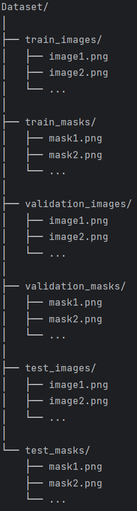

# Segmentation-Network

Das Segmentierungsnetzwerk wurde entworfen, um Bilder in verschiedene semantische Bereiche oder Segmente zu
zu unterteilen. Das Netzwerk hat die Aufgabe jedem Bildpunkt in einem Eingabebild eine Klasse zuzuweisen. Um
das Netzwerk zu trainieren werden Eingabebilder und Labels benötigt. Das Segmentierungsnetzwerk weist die 
klassische U-Net Architektur auf.

>Die Klasse 'model.py' implementiert alle Bestandteile des U-Net. Die Klasse 'dataset.py' dient der Vorverarbeitung
der Eingabedaten.

----------------------------------------------------------------------------------------------------------------
# Konfiguration

Die Konfiguration des Netzwerks erfolgt über die Datei 'config.py'. Hier können die Hyperparameter wie die
Anzahl der Epochen, die Lernrate und die Batch-Größe festgelegt werden. Die festgelegten Werte entsprechen
denen aus dem U-Net Paper von Ronneberger et al. und eignen sich hervorragend für die Segmentierung.

----------------------------------------------------------------------------------------------------------------
# Datensatz

Das Netzwerk benötigt eine Aufteilung auf Trainings-, Test- und Validierungdaten. Der Pfad zum Datensatz
muss vor dem Training individuell angepasst werden. Das Netzwerk erwartet einen Datensatz, der in folgender
Struktur vorliegt:

----------------------------------------------------------------------------------------------------------------
# Speicherort der Datensätze und Weights

Datensätze: mnt/hdd/pascalr/Segmentation-Network/Network/Dataset/

Weights: mnt/hdd/pascalr/Segmentation-Network/Network/Weights (Abgabe)/

----------------------------------------------------------------------------------------------------------------
# Ausführung des Codes (Lokal)

Ausführen von 'train.py' bzw. 'Evaluation.py' 
>  python train.py bzw. python Evaluation.py 
==> Segmentation-Network/Network/Segmentation.yaml oder siehe Dependencies

# Ausführung des Codes (Cluster)
Training:
Um das Segmentierungsnetzwerk zu trainieren wird die Klasse 'train.py' ausgeführt.
Bevor das Training durchgeführt wird ist es notwendig in der Klasse 'config.py' den
Pfad zum Datensatz und gegebenenfalls die Hyperparameter anzupassen. Um den Code
auszuführen kann die Datei 'run.sh' verwendet werden. In 'requirements' sind alle
benötigten dependencies enthalten. Folgender Befehl führt den Code erfolgreich aus:

>  submit ./run.sh --pytorch --requirements requirements --apt-install libsm6 libxext6 libxrender-dev libglib2.0-0 libgl1-mesa-glx python3-opencv --name newRun 

Evaluierung:
Um die Trainingsergebnisse nur zu evaluieren kann die Klasse 'Evaluation.py' ausgeführt
werden. Um den Code auszuführen kann die Datei 'runEvaluation.sh' verwendet werden. Vor
der Ausführung ist es notwendig in der Klasse den Pfad zum Model anzupassen.
Folgender Befehl führt den Code erfolgreich aus:

>  submit ./runEvaluation.sh --pytorch --requirements requirements --apt-install libsm6 libxext6 libxrender-dev libglib2.0-0 libgl1-mesa-glx python3-opencv --name newRun 

Falls der Befehl "--pytorch" zur Ausführung des Codes nicht explizit angegeben wird ist es 
notwendig die Requirements in der Requirements-Datei zu ergänzen (requirements.txt). Falls 
der Befehl "--apt-install libsm6 libxext6 libxrender-dev libglib2.0-0 libgl1-mesa-glx python3-opencv"
nicht explizit angegeben wird ist es notwendig die zusätzlichen Packages zu installieren (siehe unten).

----------------------------------------------------------------------------------------------------------------

# Requirements
>- python==<3.8.5>
>- PyTorch==<2.1.1>
>- TorchVision==<0.16.1>
>- scikit-learn==<1.2.2>
>- tqdm==<4.65.0>
>- matplotlib==<3.8.0>
>- numpy==<1.26.0>
>- wandb==<0.16.0>

Zusätzliche Packages:

- adwaita-icon-theme at-spi2-core dbus dbus-user-session
- dconf-gsettings-backend dconf-service dmsetup fontconfig fontconfig-config
- fonts-dejavu-core gdal-data gir1.2-glib-2.0 gsettings-desktop-schemas
- gstreamer1.0-plugins-base gtk-update-icon-cache hicolor-icon-theme
- humanity-icon-theme i965-va-driver ibverbs-providers intel-media-va-driver
- iso-codes libaacs0 libaec0 libaom3 libapparmor1 libarchive13 libargon2-1
- libarmadillo10 libarpack2 libatk-bridge2.0-0 libatk1.0-0 libatk1.0-data
- libatspi2.0-0 libavahi-client3 libavahi-common-data libavahi-common3
- libavcodec58 libavformat58 libavutil56 libbdplus0 libblas3 libblosc1
- libbluray2 libbrotli1 libbsd0 libcairo-gobject2 libcairo2 libcap2-bin
- libcdparanoia0 libcfitsio9 libcharls2 libchromaprint1 libcodec2-1.0
- libcolord2 libcryptsetup12 libcups2 libcurl3-gnutls libcurl4 libdatrie1
- libdav1d5 libdbus-1-3 libdc1394-25 libdconf1 libde265-0 libdeflate0
- libdevmapper1.02.1 libdouble-conversion3 libdrm-amdgpu1 libdrm-common
- libdrm-intel1 libdrm-nouveau2 libdrm-radeon1 libdrm2 libdw1 libedit2 libelf1
- libepoxy0 libevent-core-2.1-7 libevent-pthreads-2.1-7 libexif12 libexpat1
- libfabric1 libfontconfig1 libfreetype6 libfreexl1 libfribidi0 libfyba0
- libgd3 libgdal30 libgdcm3.0 libgdk-pixbuf-2.0-0 libgdk-pixbuf2.0-bin
- libgdk-pixbuf2.0-common libgeos-c1v5 libgeos3.10.2 libgeotiff5 libgfortran5
- libgif7 libgirepository-1.0-1 libgl1 libgl1-amber-dri libgl1-mesa-dri
- libgl2ps1.4 libglapi-mesa libglew2.2 libglib2.0-data libglvnd0 libglx-mesa0
- libglx0 libgme0 libgomp1 libgphoto2-6 libgphoto2-l10n libgphoto2-port12
- libgraphite2-3 libgsm1 libgstreamer-plugins-base1.0-0 libgstreamer1.0-0
- libgtk-3-0 libgtk-3-bin libgtk-3-common libharfbuzz0b libhdf4-0-alt
- libhdf5-103-1 libhdf5-hl-100 libheif1 libhwloc-plugins libhwloc15
- libibverbs1 libice6 libicu70 libigdgmm12 libilmbase25 libip4tc2 libjbig0
- libjson-c5 libjsoncpp25 libkmlbase1 libkmldom1 libkmlengine1 libkmod2
- liblapack3 liblcms2-2 libldap-2.5-0 libldap-common liblept5 libllvm15
- libltdl7 libmd0 libmfx1 libminizip1 libmp3lame0 libmpdec3 libmpg123-0
- libmysqlclient21 libnetcdf19 libnghttp2-14 libnl-3-200 libnl-route-3-200
- libnorm1 libnspr4 libnss-systemd libnss3 libnuma1 libodbc2 libodbcinst2
- libogdi4.1 libogg0 libopencv-calib3d4.5d libopencv-contrib4.5d
- libopencv-core4.5d libopencv-dnn4.5d libopencv-features2d4.5d
- libopencv-flann4.5d libopencv-highgui4.5d libopencv-imgcodecs4.5d
- libopencv-imgproc4.5d libopencv-ml4.5d libopencv-objdetect4.5d
- libopencv-photo4.5d libopencv-shape4.5d libopencv-stitching4.5d
- libopencv-video4.5d libopencv-videoio4.5d libopencv-viz4.5d libopenexr25
- libopengl0 libopenjp2-7 libopenmpi3 libopenmpt0 libopus0 liborc-0.4-0
- libpam-cap libpam-systemd libpango-1.0-0 libpangocairo-1.0-0
- libpangoft2-1.0-0 libpciaccess0 libpgm-5.3-0 libpixman-1-0 libpmix2
- libpoppler118 libpq5 libproj22 libprotobuf23 libpsl5 libpsm-infinipath1
- libpsm2-2 libpthread-stubs0-dev libpython3-stdlib libpython3.10-minimal
- libpython3.10-stdlib libqhull-r8.0 libquadmath0 librabbitmq4 libraw1394-11
- librdmacm1 libreadline8 librsvg2-2 librsvg2-common librtmp1 librttopo1
- libsasl2-2 libsasl2-modules libsasl2-modules-db libsensors-config
- libsensors5 libshine3 libsnappy1v5 libsocket++1 libsodium23 libsoxr0
- libspatialite7 libspeex1 libsqlite3-0 libsrt1.4-gnutls libssh-4
- libssh-gcrypt-4 libsuperlu5 libswresample3 libswscale5 libsz2 libtbb12
- libtbb2 libtbbmalloc2 libtcl8.6 libtesseract4 libthai-data libthai0
- libtheora0 libtiff5 libtk8.6 libtwolame0 libucx0 libudfread0 libunwind8
- liburiparser1 libusb-1.0-0 libva-drm2 libva-x11-2 libva2 libvdpau1
- libvisual-0.4-0 libvorbis0a libvorbisenc2 libvorbisfile3 libvpx7 libvtk9.1
- libwayland-client0 libwayland-cursor0 libwayland-egl1 libwebp7 libwebpmux3
- libx11-6 libx11-data libx11-dev libx11-xcb1 libx264-163 libx265-199
- libxau-dev libxau6 libxcb-dri2-0 libxcb-dri3-0 libxcb-glx0 libxcb-present0
- libxcb-randr0 libxcb-render0 libxcb-shm0 libxcb-sync1 libxcb-xfixes0 libxcb1
- libxcb1-dev libxcomposite1 libxcursor1 libxdamage1 libxdmcp-dev libxdmcp6
- libxerces-c3.2 libxfixes3 libxft2 libxi6 libxinerama1 libxkbcommon0 libxml2
- libxnvctrl0 libxpm4 libxrandr2 libxrender1 libxshmfence1 libxss1 libxtst6
- libxvidcore4 libxxf86vm1 libzmq5 libzvbi-common libzvbi0 media-types
- mesa-va-drivers mesa-vdpau-drivers mysql-common networkd-dispatcher
- ocl-icd-libopencl1 poppler-data proj-bin proj-data publicsuffix python3
- python3-dbus python3-gi python3-minimal python3-numpy python3-pkg-resources
- python3.10 python3.10-minimal readline-common session-migration
- shared-mime-info systemd systemd-sysv systemd-timesyncd tzdata ubuntu-mono
- ucf unixodbc-common va-driver-all vdpau-driver-all x11-common x11proto-dev
- xdg-user-dirs xkb-data xorg-sgml-doctools xtrans-dev
- adwaita-icon-theme at-spi2-core dbus dbus-user-session
- dconf-gsettings-backend dconf-service dmsetup fontconfig fontconfig-config
- fonts-dejavu-core gdal-data gir1.2-glib-2.0 gsettings-desktop-schemas
- gstreamer1.0-plugins-base gtk-update-icon-cache hicolor-icon-theme
- humanity-icon-theme i965-va-driver ibverbs-providers intel-media-va-driver
- iso-codes libaacs0 libaec0 libaom3 libapparmor1 libarchive13 libargon2-1
- libarmadillo10 libarpack2 libatk-bridge2.0-0 libatk1.0-0 libatk1.0-data
- libatspi2.0-0 libavahi-client3 libavahi-common-data libavahi-common3
- libavcodec58 libavformat58 libavutil56 libbdplus0 libblas3 libblosc1
- libbluray2 libbrotli1 libbsd0 libcairo-gobject2 libcairo2 libcap2-bin
- libcdparanoia0 libcfitsio9 libcharls2 libchromaprint1 libcodec2-1.0
- libcolord2 libcryptsetup12 libcups2 libcurl3-gnutls libcurl4 libdatrie1
- libdav1d5 libdbus-1-3 libdc1394-25 libdconf1 libde265-0 libdeflate0
- libdevmapper1.02.1 libdouble-conversion3 libdrm-amdgpu1 libdrm-common
- libdrm-intel1 libdrm-nouveau2 libdrm-radeon1 libdrm2 libdw1 libedit2 libelf1
- libepoxy0 libevent-core-2.1-7 libevent-pthreads-2.1-7 libexif12 libexpat1
- libfabric1 libfontconfig1 libfreetype6 libfreexl1 libfribidi0 libfyba0
- libgd3 libgdal30 libgdcm3.0 libgdk-pixbuf-2.0-0 libgdk-pixbuf2.0-bin
- libgdk-pixbuf2.0-common libgeos-c1v5 libgeos3.10.2 libgeotiff5 libgfortran5
- libgif7 libgirepository-1.0-1 libgl1 libgl1-amber-dri libgl1-mesa-dri
- libgl1-mesa-glx libgl2ps1.4 libglapi-mesa libglew2.2 libglib2.0-0
- libglib2.0-data libglvnd0 libglx-mesa0 libglx0 libgme0 libgomp1 libgphoto2-6
- libgphoto2-l10n libgphoto2-port12 libgraphite2-3 libgsm1
- libgstreamer-plugins-base1.0-0 libgstreamer1.0-0 libgtk-3-0 libgtk-3-bin
- libgtk-3-common libharfbuzz0b libhdf4-0-alt libhdf5-103-1 libhdf5-hl-100
- libheif1 libhwloc-plugins libhwloc15 libibverbs1 libice6 libicu70
- libigdgmm12 libilmbase25 libip4tc2 libjbig0 libjson-c5 libjsoncpp25
- libkmlbase1 libkmldom1 libkmlengine1 libkmod2 liblapack3 liblcms2-2
- libldap-2.5-0 libldap-common liblept5 libllvm15 libltdl7 libmd0 libmfx1
- libminizip1 libmp3lame0 libmpdec3 libmpg123-0 libmysqlclient21 libnetcdf19
- libnghttp2-14 libnl-3-200 libnl-route-3-200 libnorm1 libnspr4 libnss-systemd
- libnss3 libnuma1 libodbc2 libodbcinst2 libogdi4.1 libogg0
- libopencv-calib3d4.5d libopencv-contrib4.5d libopencv-core4.5d
- libopencv-dnn4.5d libopencv-features2d4.5d libopencv-flann4.5d
- libopencv-highgui4.5d libopencv-imgcodecs4.5d libopencv-imgproc4.5d
- libopencv-ml4.5d libopencv-objdetect4.5d libopencv-photo4.5d
- libopencv-shape4.5d libopencv-stitching4.5d libopencv-video4.5d
- libopencv-videoio4.5d libopencv-viz4.5d libopenexr25 libopengl0 libopenjp2-7
- libopenmpi3 libopenmpt0 libopus0 liborc-0.4-0 libpam-cap libpam-systemd
- libpango-1.0-0 libpangocairo-1.0-0 libpangoft2-1.0-0 libpciaccess0
- libpgm-5.3-0 libpixman-1-0 libpmix2 libpoppler118 libpq5 libproj22
- libprotobuf23 libpsl5 libpsm-infinipath1 libpsm2-2 libpthread-stubs0-dev
- libpython3-stdlib libpython3.10-minimal libpython3.10-stdlib libqhull-r8.0
- libquadmath0 librabbitmq4 libraw1394-11 librdmacm1 libreadline8 librsvg2-2
- librsvg2-common librtmp1 librttopo1 libsasl2-2 libsasl2-modules
- libsasl2-modules-db libsensors-config libsensors5 libshine3 libsm6
- libsnappy1v5 libsocket++1 libsodium23 libsoxr0 libspatialite7 libspeex1
- libsqlite3-0 libsrt1.4-gnutls libssh-4 libssh-gcrypt-4 libsuperlu5
- libswresample3 libswscale5 libsz2 libtbb12 libtbb2 libtbbmalloc2 libtcl8.6
- libtesseract4 libthai-data libthai0 libtheora0 libtiff5 libtk8.6 libtwolame0
- libucx0 libudfread0 libunwind8 liburiparser1 libusb-1.0-0 libva-drm2
- libva-x11-2 libva2 libvdpau1 libvisual-0.4-0 libvorbis0a libvorbisenc2
- libvorbisfile3 libvpx7 libvtk9.1 libwayland-client0 libwayland-cursor0
- libwayland-egl1 libwebp7 libwebpmux3 libx11-6 libx11-data libx11-dev
- libx11-xcb1 libx264-163 libx265-199 libxau-dev libxau6 libxcb-dri2-0
- libxcb-dri3-0 libxcb-glx0 libxcb-present0 libxcb-randr0 libxcb-render0
- libxcb-shm0 libxcb-sync1 libxcb-xfixes0 libxcb1 libxcb1-dev libxcomposite1
- libxcursor1 libxdamage1 libxdmcp-dev libxdmcp6 libxerces-c3.2 libxext6
- libxfixes3 libxft2 libxi6 libxinerama1 libxkbcommon0 libxml2 libxnvctrl0
- libxpm4 libxrandr2 libxrender-dev libxrender1 libxshmfence1 libxss1 libxtst6
- libxvidcore4 libxxf86vm1 libzmq5 libzvbi-common libzvbi0 media-types
- mesa-va-drivers mesa-vdpau-drivers mysql-common networkd-dispatcher
- ocl-icd-libopencl1 poppler-data proj-bin proj-data publicsuffix python3
- python3-dbus python3-gi python3-minimal python3-numpy python3-opencv
- python3-pkg-resources python3.10 python3.10-minimal readline-common
- session-migration shared-mime-info sudo systemd systemd-sysv
- systemd-timesyncd tzdata ubuntu-mono ucf unixodbc-common va-driver-all
- vdpau-driver-all x11-common x11proto-dev xdg-user-dirs xkb-data
- xorg-sgml-doctools xtrans-dev